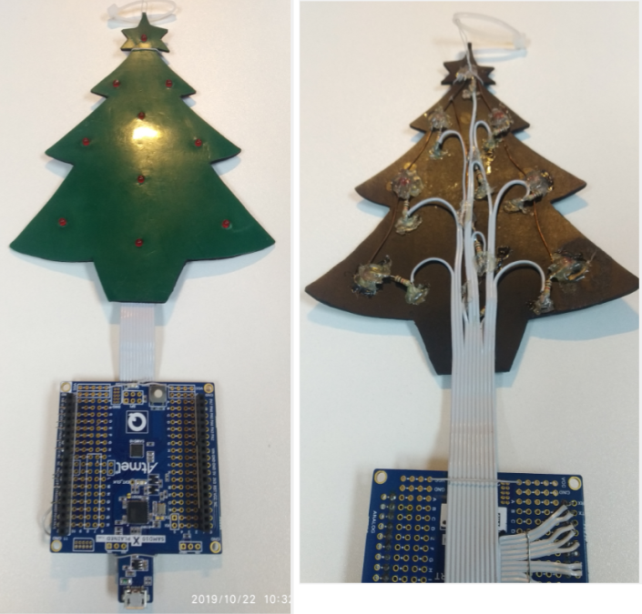

# xmas2017

'Twas 2017, some weeks before Christmas. Inspiration struct when I realized this green ESD mat on my bench infront of me can be fashioned into a Christmas tree cut-out, I can widraw some red LEDs and resistors from the store and I know I have a SAMD10-Xplained-Mini board somewhere...

The project can be re-created by starting an Atmel Studio7 ASF project for the ATSAMD10-XMINI board then use the main.c file here. The pattern sequence and duration is maintained in the transition table, and run within the systick ISR.

Can be pinned to your cubicle wall. Enjoy!

 

 